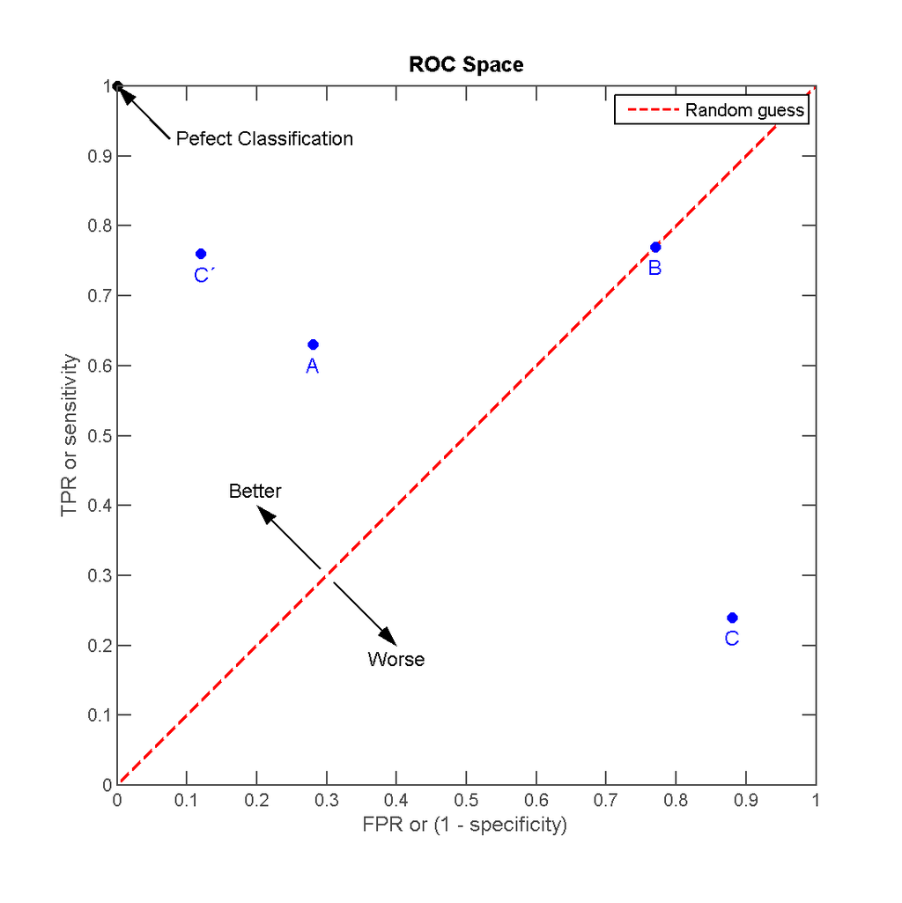

# INTRODUCTION

This project is adapted from a challenge on Kaggle (https://www.kaggle.com/anmolkumar/health-insurance-cross-sell-prediction). 

The client is an Insurance company that has provided Health Insurance to its customers and is looking to build a model to predict whether the policyholders (customers) from past year will also be interested in Vehicle Insurance provided by the company.

An insurance policy is an arrangement by which a company undertakes to provide a guarantee of compensation for specified loss, damage, illness, or death in return for the payment of a specified premium. A premium is a sum of money that the customer needs to pay regularly to an insurance company for this guarantee.

Just like medical insurance, there is vehicle insurance where every year customer needs to pay a premium of certain amount to insurance provider company so that in case of unfortunate accident by the vehicle, the insurance provider company will provide a compensation (called ‘sum assured’) to the customer.

Building a model to predict whether a customer would be interested in Vehicle Insurance is extremely helpful for the company because it can then accordingly plan its communication strategy to reach out to those customers and optimise its business model and revenue.

In this project, we aim to build supervised machine learningmodel to predict if a customer would be interested in Vehicle insurance, based on information about demographics (gender, age, region code type), Vehicles (Vehicle Age, Damage), Policy (Premium, sourcing channel) etc.

\newpage
# METHODOLOGY AND ANALYSIS

```{r setup,  echo=FALSE, message=FALSE, warning=FALSE}
if(!require(tidyverse)) install.packages("tidyverse", repos = "http://cran.us.r-project.org")
if(!require(RCurl)) install.packages("RCurl", repos = "http://cran.us.r-project.org")
if(!require(summarytools)) install.packages("summarytools", repos = "http://cran.us.r-project.org")
if(!require(RColorBrewer)) install.packages("RColorBrewer", repos = "http://cran.us.r-project.org")
if(!require(ggplot2)) install.packages("ggplot2", repos = "http://cran.us.r-project.org")
if(!require(caret)) install.packages("caret", repos = "http://cran.us.r-project.org")
if(!require(randomForest)) install.packages("randomForest", repos = "http://cran.us.r-project.org")
if(!require(corrplot)) install.packages("corrplot", repos = "http://cran.us.r-project.org")
if(!require(pROC)) install.packages("pROC", repos = "http://cran.us.r-project.org")
if(!require(knitr)) install.packages("knitr", repos = "http://cran.us.r-project.org")

# Following setting to keep code from running off the rmd page.
opts_chunk$set(tidy.opts=list(width.cutoff=60),tidy=TRUE)
opts_chunk$set(fig.width=12, fig.height=8) 
```

## Libraries Used

The libraries used for this project are as follows:

```{r, echo=TRUE, message=FALSE, warning=FALSE}
library(tidyverse)
library(RCurl)
library(summarytools)
library(RColorBrewer)
library(ggplot2)
library(caret)
library(randomForest)
library(corrplot)
library(pROC)
library(knitr)
```


## Loading the Data

The original dataset from Kaggle includes both test and training datasets. However, as the files were taken from a kaggle competition, the test dataset did not contain the dependent variable. As such, I split the training dataset into my own testing and training sets so that the resulting prediction of the machine learning model could be displayed. 

The total number of observations in the set was 381,109, which was quite big and difficult for my computer to process. I reduced the total dataset to 150000 and split the dataset 80:20 such that caret training models could be run effectively.

The data has been uploaded onto github and is accessible with the following code. 

```{r,  echo=TRUE, warning=FALSE, message=FALSE}

data_source <- getURL("https://raw.githubusercontent.com/birddropping/Harvard-Capstone-Health-Insurance/main/train.csv")
data <- read.csv(text = data_source)

data <- data[1:150000,]

```

The dataset contains the following features and dependent variable:

### Features

Id - Unique ID for the customer

Gender - Gender of the customer

Age - Age of the customer

Driving_License - 0: Customer does not have driving license; 1: Customer already has driving license

Region_Code - Unique code for the region of the customer

Previously_Insured - 1: Customer already has Vehicle Insurance; 0: Customer doesn't have Vehicle Insurance

Vehicle_Age - Age of the vehicle

Vehicle_Damage - 1: Customer got his/her vehicle damaged in the past; 0: Customer didn't get his/her vehicle damaged in the past

Annual_Premium - The amount the customer needs to pay as premium in the year

Policy_Sales_Channel - Anonymized code for the channel of outreaching to the customer e.g. Different agents, over mail, over phone, in person, etc. 

Vintage - Number of days that the customer has been associated with the company

### Dependent Variable

Response - 1: Customer is interested; 0: Customer is not interested

The first few lines of the dataset is shown below:

```{r, echo=TRUE, warning=FALSE}
head(data)
```

## Data Cleaning

The loaded data was codified, categorical data except for the response was converted into integers. Responses were converted from binary numerals 0 and 1 to "N" and "Y" factors because the caret package was not able to perform training on the "0" integer. 
 
```{r, echo=TRUE, warning=FALSE, message=FALSE}

# Converting all inputs to numeric values

# Gender #
data$Gender[data$Gender == "Male"] <- 1
data$Gender[data$Gender == "Female"] <- 2

# Vehicle Age #
data$Vehicle_Age[data$Vehicle_Age == "< 1 Year"] <- 1
data$Vehicle_Age[data$Vehicle_Age == "1-2 Year"] <- 2
data$Vehicle_Age[data$Vehicle_Age == "> 2 Years"] <- 3

# Vehicle Damage #
data$Vehicle_Damage[data$Vehicle_Damage == "No"] <- 0
data$Vehicle_Damage[data$Vehicle_Damage == "Yes"] <- 1

# Converting Responses #
data$Response <- as.numeric(data$Response)
data$Response[data$Response == 0] <- "N"
data$Response[data$Response == 1] <- "Y"

# Converting all columns to factor type

data <- lapply(data, as.factor)
data <- as.data.frame(data)

# Change Age, Annual Premiums and Vintage to numeric as they are continuous data

data$Age <- as.numeric(data$Age)
data$Annual_Premium <- as.numeric(data$Annual_Premium)
data$Region_Code <- as.numeric(data$Region_Code)
data$Policy_Sales_Channel <- as.numeric(data$Policy_Sales_Channel)
data$Vintage <- as.numeric(data$Vintage)

```


## Data Partitioning

Once the dataset was converted into respective factors and numerical data, the data was partitioned out into a training set (edx), as well as a validation set (validation). The validation set would not be used until the final testing of the machine learning model. 

To test the model during the developmental phase, the training set was partitioned a second time into another training and test set: edx_train and edx_test.

All sets were semi-joined with the training data such that none of the features captured as part of the machine learning model would be out of range. 

```{r, echo=TRUE, message=FALSE, warning=FALSE}

set.seed(1, sample.kind="Rounding")
test_index <- createDataPartition(data$Response, times = 1, p = 0.2, list = FALSE)

validation <- data[test_index, ]
edx <- data[-test_index, ]

validation <- validation %>% 
  semi_join(edx, by = "Gender") %>%
  semi_join(edx, by = "Driving_License") %>%
  semi_join(edx, by = "Region_Code") %>%
  semi_join(edx, by = "Previously_Insured") %>%
  semi_join(edx, by = "Vehicle_Damage") %>%
  semi_join(edx, by = "Policy_Sales_Channel")


set.seed(1, sample.kind="Rounding")
test_index <- createDataPartition(edx$Response, times = 1, p = 0.2, list = FALSE)

edx_test <- edx[test_index, ]

edx_train <- edx[-test_index, ]

edx_test <- edx_test %>% 
  semi_join(edx_train, by = "Gender") %>%
  semi_join(edx_train, by = "Driving_License") %>%
  semi_join(edx_train, by = "Region_Code") %>%
  semi_join(edx_train, by = "Previously_Insured") %>%
  semi_join(edx_train, by = "Vehicle_Damage") %>%
  semi_join(edx_train, by = "Policy_Sales_Channel")

rm(data_source, test_index, data)
```

\newpage
## Data Exploration

### Correlation Plot

```{r, echo=FALSE, warning=FALSE}

train_cor <- edx_train %>% mutate_if(is.factor, as.numeric)

cor(train_cor, use="pairwise.complete.obs", method = c("pearson", "kendall", "spearman"))  %>% 
  corrplot( method = "pie", type= "upper", outline = T, tl.col = "black",tl.srt=50,col=c("red", "blue"))
```

From this correlation plot, we see that Gender, Age and the Policy Sales Channel used to attract the customer has a mild correlation with the response of the customer, and Vehicle Age, previous Vehicle Damage and whether they have been previously insured has a moderate correlation with the response. We will examine these factors in the next few steps.

\newpage
### Overall proportion of people taking up insurance

To begin, the proportion of customers who eventually take up the vehicle insurance is assessed.

```{r, echo=FALSE, warning=FALSE}
edx_train %>% 
  group_by(Response) %>%
  count()
```

We see that only 13.9% of customers were eventually took up the vehicle insurance, which suggests that the data is imbalanced. 

\newpage
### Gender

To see the differences in the conversions between genders, we plot a bar chart of the 2 genders, and highlight the number of customers who eventually responded positively. 

```{r, echo=FALSE, warning=FALSE}
edx_train %>% 
  ggplot(aes(x=Gender)) +
  geom_bar(aes(fill=Response)) + 
  geom_text(stat='count', aes(label=..count..), vjust=3) + 
  ggtitle("Distribution of customers by gender")

edx_train %>%
  group_by(Gender, Response) %>% 
  summarise(n = n()) %>%
  mutate(percentage = paste0(round(100 * n/sum(n), 0), "%"))
```

As can be seen in the graph, as well as from the percentage summary, males seem to be slightly more inclined to take up the insurance than females. 

\newpage
### Age

Age may also play a factor in the decision to take up vehicle insurance. The case does not make it clear, and as there are some customers who are of a very young age holding on to a driving license, I make the assumption that age in this case indicates the driver's age starting from the legal age for driving (e.g. 1 = 19 assuming the legal age to drive is 18). 

We plot a density plot of the various ages and their response to the offer to take up vehicle insurance:

```{r, echo=FALSE, warning=FALSE}

edx_train %>% 
  ggplot(aes(x=Age)) + 
  geom_density(aes(fill=Response), alpha = 0.5)+ 
  ggtitle("Distribution of customers by age, grouped by response")
```

As we can see, there indeed is a distinction between younger and older drivers. younger drivers tend to not respond favourably, whereas older drivers tend to be more receptive to taking up vehicle insurance.

\newpage
### Previous Insurance

```{r, echo=FALSE, warning=FALSE}

edx_train %>%
  ggplot(aes(x=Previously_Insured)) +
  geom_bar(aes(fill=Response)) + 
  ggtitle("Number of customers who have been previously insured")

edx_train %>%
  group_by(Previously_Insured, Response) %>%
  summarise(n = n()) %>%
  mutate(percentage = paste0(round(100 * n/sum(n), 0), "%"))
```

The aspect of being previously insured seems to be an important deciding factor in determining if someone will take up the vehicle insurance. From this plot, we see that most people who have  been previously insured chose not to take up the insurance, with only 36 out of 43959 individuals chose to take up the insurance. However, on the other hand, 23% of people who were not previously insured chose to take up the insurance. This may be the case because people who were previously insured would probably have existing plans still in place and would not require additional vehicle insurance.

\newpage
### Regions 

We explore the distribution of the customers across the various regions.

```{r, echo=FALSE, warning=FALSE}
edx_train %>%
  ggplot(aes(y=Region_Code)) +
  geom_bar(aes(fill = Region_Code)) +
  ggtitle("Total number of customers by region")

region <- edx_train %>%
  group_by(Region_Code, Response) %>%
  summarise(n = n()) %>%
  mutate(percentage = round(100 * n/sum(n), 0)) %>% 
  filter(Response == "Y")

region %>%
  ggplot(aes(x = Region_Code, y = as.numeric(percentage))) +
  geom_point() + 
  ggtitle("Percentage of customers that take up insurance by region code") + 
  labs(y = "Percentage Uptake of Insurance")
```

We can see from these plots that that there is a huge variation in the number of customers hailing from each of the individual regions. There is also a difference in percentage of customers taking up the vehicle insurance by region. However, given that most regions have very few customers, percentage uptake rates may not be very accurate. To understand the extent of variation between region codes, we compare the two regions with the minimum and maximum number of customers.

```{r, echo=FALSE, warning=FALSE}
region <- edx_train %>%
  group_by(Region_Code, Response) %>%
  summarise(n = n()) %>%
  mutate(percentage = round(100 * n/sum(n), 0)) 
```

```{r, echo=FALSE, warning=FALSE}
max(region$n)
min(region$n)
```

As we can see, the largest region had a total of 21690 customers, and the smallest region had only 8 customers. Given that region_code was not identified as a differential feature in the correlation plot, I decided not to use it in the development of the predictive model. 

\newpage
### Length of Car Ownership

Next I explored the distribution of length of car ownership. I plotted a density plot of the ages of the drivers, grouped by the age of their vehicle.

```{r, echo=FALSE, warning=FALSE}
edx_train %>%
  ggplot(aes(x=Age, group=Vehicle_Age, fill=Vehicle_Age)) +
  geom_density(adjust=2, alpha = 0.4)
# Higher proportion of people who take up the insurance when their cars are older could be because of the fact that drivers who have older cars tend to be older themselves. 
```

As we can see, younger drivers tend to have newer cars. This is not surprising, as new drivers tend to buy new cars, and older drivers may have driven their cars for a period of time. We then explore the number of customers who took up the insurance based on the age of their car.

```{r, echo=FALSE, warning=FALSE}
edx_train %>%
  ggplot(aes(x=Vehicle_Age)) +
  geom_bar(aes(fill = Response)) +
  geom_text(stat='count', aes(label=..count..), vjust=-0.8)

edx_train %>%
  group_by(Vehicle_Age, Response) %>%
  summarise(n = n()) %>%
  mutate(percentage = round(100 * n/sum(n), 0))
```

The graphs demonstrate that drivers with older vehicles are more likely to take up insurance. The percentage of drivers who choose to take up car insurance increases with the age of the car, with  4% of owners of new cars (<1 year old), 17% of owners of car between 1 and 2 years of age, and 30% of owners of cars at least 2 years old took up insurance

\newpage
### Past Vehicle Damage

The number of customers with past vehicle damage is plotted, and the number of customers who took up vehicle insurance is highlighted. 

```{r, echo=FALSE, warning=FALSE}
edx_train %>%
  ggplot(aes(x=Vehicle_Damage)) + 
  geom_bar(aes(fill=Response))
```

We can see a clear distinction between those with a history of past vehicle damage. They are much more likely than the customers with no history of vehicle damage to take up vehicle insurance. 

\newpage
### Distribution of Policy Sales Channels

The company utilises a large number of policy sales channels to connect with their customers. The following graph shows the distribution of customers across the various policy sales channels.

```{r, echo=FALSE, warning=FALSE}
edx_train %>% 
  ggplot(aes(as.numeric(Policy_Sales_Channel))) +
  geom_bar(aes(fill = Response), alpha = 0.3) + 
  ggtitle("Distribution of customers by policy sales channel")
```

In this graph, we can see that there is a large variation in the customers obtained through the various sales channels, as well as in the success rates of the various channels.  

To visualise the most successful sales channels, we sort the percentage of a positive responses in descending order:

```{r, echo=FALSE, warning=FALSE}
edx_train %>% 
  group_by(Policy_Sales_Channel, Response) %>%
  summarise(n = n()) %>% 
  mutate(percentage = round(100 * n/sum(n), 0)) %>%
  filter(Response == "Y") %>%
  arrange(desc(percentage)) %>% 
  head()
```

Sorted in ascending order, the sales channels with the lowest rates of conversion are:

```{r, echo=FALSE, warning=FALSE}
edx_train %>% 
  group_by(Policy_Sales_Channel, Response) %>%
  summarise(n = n()) %>% 
  mutate(percentage = round(100 * n/sum(n), 0)) %>%
  filter(Response == "Y") %>%
  arrange(percentage) %>% 
  head()
```

This shows that there are some policy sales channels that work better than others. Some of the data may be skewed because of the lack of customers in certain sales channels, but this feature shows significant differential potential and will be included into the machine learning model.

\newpage
## Model Building

### Model Evaluation Metric

As the data is imbalanced and there are a lot less people who take up the insurance than those that do not, classification accuracy may not be the most suitable metric to use in evaluating between the various machine learning models. As such, we use the Area-under-curve (AUC) of the Receiver Operating Characteristic (ROC) Curve to distinguish between the various methods instead. 

The ROC curve is a graphical plot that illustrates the diagnostic ability of the binary classifier system as its discrimination threshold is varied. It is created by plotting the true positive rate against the false positive rate at various threshold settings. Higher AUC values highlights a model's ability to correctly identify true positives with little misclassification of false positives. 



In the case of actual prediction values generated by the machine learning model on the test dataset, the returned predictions are a probabilistic value between 0 to 1. To determine which values will be considered a positive or negative response, a probability threshold is required (e.g. Equating probabilities of > 0.3 to be a positive response). In such a scenario, it is important to find a threshold that balances between minimising false positives and maximising true positives. 

Though setting a threshold for predictions can sometimes be regarded as over-training, and the Kaggle contest's aim was to determine the model with the highest AUC, I selected a probability threshold with the use of Youden's J statistic for the purpose of predicting outcomes in the validation dataset. Youden's J statistic is defined as the intercept of the ROC curve with the tangent at 45 degrees parallel to the no-discrimination line that is closest to the error-free point (0,1), and is employed as a criterion for selecting the optimum cut-off point when a diagnostic test gives a numeric rather than a dichotomous result. 

With this evaluation metric in mind, I test a variety of various classification models on the edx_train dataset, and evaluate them based on the ROC-AUC and the J statistic. 

### Model Testing

The models in this section are tested through the following steps: 

1. Tuning of the models are optimised for 5-fold cross-validation. 

2. Train function from the caret package is utilised to produce the fit from the edx_train set. The model is trained with ROC as the metric of choice as previously explained. The features selected for training with the caret package include: Gender, Age, Previously_Insured, Vehicle_Age, Vehicle_Damage, and the Policy_Sales_Channel. 

3. We index the predictions that utilise the best identified hyperparameters, and produce the ROC plot. This allows us to then calculate the coordinates of Youden's J statistic.

4. Predictions are made with the predict function by applying the fit to edx_test is calculated using the probability threshold identified with the J-statistic, and the confusion matrix is generated. 

5. The ROC-AUC and the J statistic are noted, and consolidated into a list for comparison with other models. 

6. Model with the best ROC-AUC and J-statistic will be selected for testing on the final validation set.

The algorithms used include: Naive Bayes, k-Nearest Neighbours, Generalized Linear Model, Linear Discriminatory Analysis, Boosted classification trees, Stochastic Gradient Boosting, Quadratic Discriminatory Analysis, Random forest, Boosted Logistic Regression, and eXtreme Gradient Boosting. 


### Naive Bayes


```{r, echo=TRUE, warning=FALSE, message=FALSE}
# Set control parameters for cross validation
control_bayes <- trainControl(method = "cv", number = 5, savePredictions = TRUE, classProbs = TRUE, verboseIter = TRUE, summaryFunction = twoClassSummary)

# Train fit using caret package. Metric set to ROC
fit_bayes <- train(Response ~ Gender + Age + Previously_Insured + Vehicle_Age + Vehicle_Damage + Policy_Sales_Channel, method = "naive_bayes", data = edx_train, trControl = control_bayes, metric = "ROC")


# Selecting best hyperparameters for Naive Bayes model to plot the ROC curve
index_bayes <- fit_bayes$pred$usekernel == as.logical(fit_bayes$bestTune[2])

roc_bayes <- roc(fit_bayes$pred$obs[index_bayes],
                 fit_bayes$pred$Y[index_bayes])
```

```{r, echo=TRUE, warning=FALSE}
# Plotting ROC curve with Youden's index highlighted
plot(roc_bayes,print.thres="best",  print.thres.best.method="youden")

J_bayes <- coords(roc_bayes, x="best", input = c("threshold", "specificity", "sensitivity"), best.method = "youden", transpose=TRUE)

# Generating predictions on the edx_test set with the fit, optimised for probabilistic threshold set by Youden's statistic
y_hat_bayes  <- ifelse(predict(fit_bayes, edx_test, type="prob")> J_bayes[1], "Y", "N")
y_hat_bayes <- as.factor(y_hat_bayes[,2])
confusionMatrix(y_hat_bayes, edx_test$Response, positive = "Y", mode = "everything")

# Results of the model are added to a rolling list to compare models
model_AUC <- data.frame("Naive Bayes", round(roc_bayes$auc, digits=4), J = round((as.numeric(J_bayes[3]) + as.numeric(J_bayes[2]) - 1), digits = 4))
colnames(model_AUC) <- c("Model", "AUC", "J-Statistic")
model_AUC

rm(control_bayes, fit_bayes, roc_bayes,J_bayes, y_hat_bayes)

```


### KNN - K-Nearest Neighbours

```{r, include=FALSE, echo=FALSE, warning=FALSE, message=FALSE}
control_knn <- trainControl(method = "cv", number = 5, savePredictions = TRUE, classProbs = TRUE, verboseIter = TRUE, summaryFunction = twoClassSummary)

# Region_Code is added as an additional prediction feature because knn fails to work with the other 6 classifiers alone. Given that the other 6 features are categorical data, the error: 'too many ties in knn' was returned and caused the training to fail. 

fit_knn <- train(Response ~ Gender + Age + Previously_Insured + Vehicle_Age + Vehicle_Damage + Policy_Sales_Channel + Region_Code, preProcess = c("center", "scale"), method = "knn", data = edx_train, trControl = control_knn, metric = "ROC") 

index_knn <- fit_knn$pred$k == as.numeric(fit_knn$bestTune)

roc_knn <- roc(fit_knn$pred$obs[index_knn],
               fit_knn$pred$Y[index_knn])
```

```{r, echo=FALSE, warning=FALSE}
plot(roc_knn, print.thres="best", print.thres.best.method="youden")  

J_knn <- coords(roc_knn, x="best", input = c("threshold", "specificity", "sensitivity"), best.method = "youden", transpose=TRUE)

y_hat_knn <- ifelse(predict(fit_knn, edx_test, type="prob")> J_knn[1], "Y", "N")
y_hat_knn <- as.factor(y_hat_knn[,2])
confusionMatrix(y_hat_knn, edx_test$Response, positive = "Y", mode = "everything")

model_AUC <- rbind(model_AUC, c("kNN", round(roc_knn$auc, digits=4),J = round((as.numeric(J_knn[3]) + as.numeric(J_knn[2]) - 1), digits = 4)))
model_AUC

rm(control_knn, fit_knn, roc_knn,J_knn, y_hat_knn)

```


### GLM - Generalized Linear Model

```{r, include=FALSE, echo=FALSE, warning=FALSE, message=FALSE}
control_glm <- trainControl(method = "cv", number = 5, savePredictions = TRUE, classProbs = TRUE, verboseIter = TRUE, summaryFunction = twoClassSummary)

fit_glm <- train(Response ~ Gender + Age + Previously_Insured + Vehicle_Age + Vehicle_Damage + Policy_Sales_Channel, method = "glm", data = edx_train, trControl = control_glm, metric = "ROC")

# No hyperparameters for GLM

roc_glm <- roc(fit_glm$pred$obs,
                 fit_glm$pred$Y)
```

```{r, echo=FALSE, warning=FALSE}
plot(roc_glm, print.thres="best", print.thres.best.method="youden")  

J_glm <- coords(roc_glm, x="best", input = c("threshold", "specificity", "sensitivity"), best.method = "youden", transpose=TRUE)

y_hat_glm <- ifelse(predict(fit_glm, edx_test, type="prob")> J_glm[1], "Y", "N")
y_hat_glm <- as.factor(y_hat_glm[,2])
confusionMatrix(y_hat_glm, edx_test$Response, positive = "Y", mode = "everything")

model_AUC <- rbind(model_AUC, c("Generalized Linear Model", round(roc_glm$auc, digits=4),J = round((as.numeric(J_glm[3]) + as.numeric(J_glm[2]) - 1), digits = 4)))
model_AUC

rm(control_glm, fit_glm, roc_glm,J_glm, y_hat_glm)

```


### LDA - Linear Discriminatory Analysis 


```{r, include=FALSE, echo=FALSE, warning=FALSE, message=FALSE}
control_lda <- trainControl(method = "cv", number = 5, savePredictions = TRUE, classProbs = TRUE, verboseIter = TRUE, summaryFunction = twoClassSummary)

fit_lda <- train(Response ~ Gender + Age + Previously_Insured + Vehicle_Age + Vehicle_Damage + Policy_Sales_Channel, method = "lda", data = edx_train, trControl = control_lda, metric = "ROC")

# No hyperparameters for LDA

roc_lda <- roc(fit_lda$pred$obs,
               fit_lda$pred$Y)
```

```{r, echo=FALSE, warning=FALSE}
plot(roc_lda, print.thres="best", print.thres.best.method="youden")

J_lda <- coords(roc_lda, x="best", input = c("threshold", "specificity", "sensitivity"), best.method = "youden", transpose=TRUE)

y_hat_lda <- ifelse(predict(fit_lda, edx_test, type="prob")> J_lda[1], "Y", "N")
y_hat_lda <- as.factor(y_hat_lda[,2])
confusionMatrix(y_hat_lda, edx_test$Response, positive = "Y", mode = "everything")


model_AUC <- rbind(model_AUC, c("Quadratiic Discriminant Analysis", round(roc_lda$auc, digits=4),J = round((as.numeric(J_lda[3]) + as.numeric(J_lda[2]) - 1), digits = 4)))
model_AUC

rm(control_lda, fit_lda, roc_lda,J_lda, y_hat_lda)
```


### ada - Boosted classification trees 


```{r, include=FALSE, echo=FALSE, warning=FALSE, message=FALSE}
control_ada <- trainControl(method = "cv", number = 3, savePredictions = TRUE, classProbs = TRUE, verboseIter = TRUE, summaryFunction = twoClassSummary)

fit_ada <- train(Response ~ Gender + Age + Previously_Insured + Vehicle_Age + Vehicle_Damage + Policy_Sales_Channel, method = "ada", data = edx_train, trControl = control_ada, metric = "ROC")

index_ada <- (fit_ada$pred$iter == as.numeric(fit_ada$bestTune[1]) & fit_ada$pred$maxdepth == as.numeric(fit_ada$bestTune[2]) & fit_ada$pred$nu == as.numeric(fit_ada$bestTune[3]))

roc_ada <- roc(fit_ada$pred$obs[index_ada],
               fit_ada$pred$Y[index_ada])
```

```{r, echo=FALSE, warning=FALSE}
plot(roc_ada, print.thres="best", print.thres.best.method="youden")  

J_ada <- coords(roc_ada, x="best", input = c("threshold", "specificity", "sensitivity"), best.method = "youden", transpose=TRUE)

y_hat_ada <- ifelse(predict(fit_ada, edx_test, type="prob")> J_ada[1], "Y", "N")
y_hat_ada <- as.factor(y_hat_ada[,2])
confusionMatrix(y_hat_ada, edx_test$Response, positive = "Y", mode = "everything")

model_AUC <- rbind(model_AUC, c("Boosted Classification Trees", round(roc_ada$auc, digits=4),J = round((as.numeric(J_ada[3]) + as.numeric(J_ada[2]) - 1), digits = 4)))
model_AUC

rm(control_ada, fit_ada, roc_ada,J_ada, y_hat_ada)

```


### GBM - Stochastic Gradient Boosting 

```{r, include=FALSE, echo=FALSE, warning=FALSE, message=FALSE}
control_gbm <- trainControl(method = "cv", number = 3, savePredictions = TRUE, classProbs = TRUE, verboseIter = TRUE, summaryFunction = twoClassSummary)

fit_gbm <- train(Response ~ Gender + Age + Previously_Insured + Vehicle_Age + Vehicle_Damage + Policy_Sales_Channel, method = "gbm", data = edx_train, trControl = control_gbm, metric = "ROC")
fit_gbm$bestTune[4]

index_gbm <- (fit_gbm$pred$n.trees == as.numeric(fit_gbm$bestTune[1]) & fit_gbm$pred$interaction.depth == as.numeric(fit_gbm$bestTune[2]) & fit_gbm$pred$shrinkage == as.numeric(fit_gbm$bestTune[3]) & fit_gbm$pred$n.minobsinnode == as.numeric(fit_gbm$bestTune[4])) 

roc_gbm <- roc(fit_gbm$pred$obs[index_gbm],
               fit_gbm$pred$Y[index_gbm])
```

```{r, echo=FALSE, warning=FALSE}
plot(roc_gbm, print.thres="best", print.thres.best.method="youden")  

J_gbm <- coords(roc_gbm, x="best", input = c("threshold", "specificity", "sensitivity"), best.method = "youden", transpose=TRUE)

y_hat_gbm <- ifelse(predict(fit_gbm, edx_test, type="prob")> J_gbm[1], "Y", "N")
y_hat_gbm <- as.factor(y_hat_gbm[,2])
confusionMatrix(y_hat_gbm, edx_test$Response, positive = "Y", mode = "everything")

model_AUC <- rbind(model_AUC, c("Stochastic Gradient Boostiing", round(roc_gbm$auc, digits=4),J = round((as.numeric(J_gbm[3]) + as.numeric(J_gbm[2]) - 1), digits = 4)))
model_AUC

rm(control_gbm, fit_gbm, roc_gbm,J_gbm, y_hat_gbm)

```


### QDA - Quadratic Discriminatory Analysis

```{r, include=FALSE, echo=FALSE, warning=FALSE, message=FALSE}
control_qda <- trainControl(method = "cv", number = 5, savePredictions = TRUE, classProbs = TRUE, verboseIter = TRUE, summaryFunction = twoClassSummary)

fit_qda <- train(Response ~ Gender + Age + Previously_Insured + Vehicle_Age + Vehicle_Damage + Policy_Sales_Channel, method = "qda", data = edx_train, trControl = control_qda, metric = "ROC")

# No hyperparameters for QDA

roc_qda <- roc(fit_qda$pred$obs,
               fit_qda$pred$Y)
```

```{r, echo=FALSE, warning=FALSE}
plot(roc_qda, print.thres="best", print.thres.best.method="youden")

J_qda <- coords(roc_qda, x="best", input = c("threshold", "specificity", "sensitivity"), best.method = "youden", transpose=TRUE)

y_hat_qda <- ifelse(predict(fit_qda, edx_test, type="prob")> J_qda[1], "Y", "N")
y_hat_qda <- as.factor(y_hat_qda[,2])
confusionMatrix(y_hat_qda, edx_test$Response, positive = "Y", mode = "everything")

model_AUC <- rbind(model_AUC, c("Quadratiic Discriminant Analysis", round(roc_qda$auc, digits=4),J = round((as.numeric(J_qda[3]) + as.numeric(J_qda[2]) - 1), digits = 4)))
model_AUC

rm(control_qda, fit_qda, roc_qda,J_qda, y_hat_qda)

```


### RF - Random forest

```{r, include=FALSE, echo=FALSE, warning=FALSE, message=FALSE}
control_rf <- trainControl(method = "cv", number = 5, savePredictions = TRUE, classProbs = TRUE, verboseIter = TRUE, summaryFunction = twoClassSummary)

fit_rf <- train(Response ~ Gender + Age + Previously_Insured + Vehicle_Age + Vehicle_Damage + Policy_Sales_Channel, method = "rf", data = edx_train, trControl = control_rf, metric = "ROC")

index_rf <- fit_rf$pred$mtry == as.numeric(fit_rf$bestTune)

roc_rf <- roc(fit_rf$pred$obs[index_rf],
              fit_rf$pred$Y[index_rf])
```

```{r, echo=FALSE, warning=FALSE}
plot(roc_rf, print.thres="best", print.thres.best.method="youden")

J_rf <- coords(roc_rf, x="best", input = c("threshold", "specificity", "sensitivity"), best.method = "youden", transpose=TRUE)

y_hat_rf <- ifelse(predict(fit_rf, edx_test, type="prob")> J_rf[1], "Y", "N")
y_hat_rf <- as.factor(y_hat_rf[,2])
confusionMatrix(y_hat_rf, edx_test$Response, positive = "Y", mode = "everything")

model_AUC <- rbind(model_AUC, c("Random Forests", round(roc_rf$auc, digits=4),J = round((as.numeric(J_rf[3]) + as.numeric(J_rf[2]) - 1), digits = 4)))
model_AUC

rm(control_rf, fit_rf, roc_rf,J_rf, y_hat_rf)

```


### LogitBoost - Boosted Logistic Regression

```{r, include=FALSE, echo=FALSE, warning=FALSE, message=FALSE}
control_logboost <- trainControl(method = "cv", number= 5, summaryFunction = twoClassSummary, classProbs = TRUE, verboseIter = TRUE, savePredictions = TRUE)

fit_logboost <- train(Response ~ Gender + Age + Previously_Insured + Vehicle_Age + Vehicle_Damage + Policy_Sales_Channel, method = "LogitBoost", data = edx_train, metric="ROC", trControl = control_logboost)

index_logboost <- fit_logboost$pred$nIter == as.numeric(fit_logboost$bestTune)

roc_logboost <- roc(fit_logboost$pred$obs[index_logboost],
                    fit_logboost$pred$Y[index_logboost])
```

```{r, echo=FALSE, warning=FALSE}
plot(roc_logboost, print.thres="best", print.thres.best.method="youden")

J_logboost <- coords(roc_logboost, x="best", input = c("threshold", "specificity", "sensitivity"), best.method = "youden", transpose=TRUE)

y_hat_logboost <- ifelse(predict(fit_logboost, edx_test, type="prob")> J_logboost[1], "Y", "N")
y_hat_logboost <- as.factor(y_hat_logboost[,2])
confusionMatrix(y_hat_logboost, edx_test$Response, positive = "Y", mode = "everything")

model_AUC <- rbind(model_AUC, c("Boosted Logistic Regression", round(roc_logboost$auc, digits=4),J = round((as.numeric(J_logboost[3]) + as.numeric(J_logboost[2]) - 1), digits = 4)))
model_AUC

rm(control_logboost, fit_logboost, roc_logboost,J_logboost, y_hat_logboost)

```


### XGB - eXtreme Gradient Boosting

```{r, include=FALSE, echo=FALSE, warning=FALSE, message=FALSE}
control_xgb <- trainControl(method = "cv", number = 5, savePredictions = TRUE, classProbs = TRUE, verboseIter = TRUE, summaryFunction = twoClassSummary)

fit_xgb <- train(Response ~ Gender + Age + Previously_Insured + Vehicle_Age + Vehicle_Damage + Policy_Sales_Channel, method = "xgbTree", data = edx_train, metric = "ROC", trControl = control_xgb)

index_xgb <- (fit_xgb$pred$nrounds == as.numeric(fit_xgb$bestTune[1]) & fit_xgb$pred$max_depth == as.numeric(fit_xgb$bestTune[2]) & fit_xgb$pred$eta == as.numeric(fit_xgb$bestTune[3]) & fit_xgb$pred$gamma == as.numeric(fit_xgb$bestTune[4]) & fit_xgb$pred$colsample_bytree == as.numeric(fit_xgb$bestTune[5]) & fit_xgb$pred$min_child_weight == as.numeric(fit_xgb$bestTune[6]) & fit_xgb$pred$subsample == as.numeric(fit_xgb$bestTune[7]))

roc_xgb <- roc(fit_xgb$pred$obs[index_xgb],
                    fit_xgb$pred$Y[index_xgb])
```

```{r, echo=FALSE, warning=FALSE}
plot(roc_xgb, print.thres="best", print.thres.best.method="youden")

J_xgb <- coords(roc_xgb, x="best", input = c("threshold", "specificity", "sensitivity"), best.method = "youden", transpose=TRUE)

y_hat_xgb <- ifelse(predict(fit_xgb, edx_test, type="prob")> J_xgb[1], "Y", "N")
y_hat_xgb <- as.factor(y_hat_xgb[,2])
confusionMatrix(y_hat_xgb, edx_test$Response, positive = "Y", mode = "everything")

model_AUC <- rbind(model_AUC, c("eXtreme Gradient Boosting", round(roc_xgb$auc, digits=4),J = round((as.numeric(J_xgb[3]) + as.numeric(J_xgb[2]) - 1), digits = 4)))
model_AUC


rm(control_xgb, fit_xgb, roc_xgb,J_xgb, y_hat_xgb)

```


\newpage

# Results

## Final Model

The best results for both ROC-AUC and the J statistic were achieved with the extreme gradient boosting method. As such, I will proceed to train this model with the full edx dataset, and test the model on the final validation set. 

```{r, include=FALSE, echo=FALSE, warning=FALSE, message=FALSE}
final_control <- trainControl(method = "cv", number = 5, savePredictions = TRUE, classProbs = TRUE, verboseIter = TRUE, summaryFunction = twoClassSummary)

fit_final <- train(Response ~ Gender + Age + Previously_Insured + Vehicle_Age + Vehicle_Damage + Policy_Sales_Channel, method = "xgbTree", data = edx, metric = "ROC", trControl = final_control)

# Determining best hyperparameters too use for the model

index_final <- (fit_final$pred$nrounds == as.numeric(fit_final$bestTune[1]) & fit_final$pred$max_depth == as.numeric(fit_final$bestTune[2]) & fit_final$pred$eta == as.numeric(fit_final$bestTune[3]) & fit_final$pred$gamma == as.numeric(fit_final$bestTune[4]) & fit_final$pred$colsample_bytree == as.numeric(fit_final$bestTune[5]) & fit_final$pred$min_child_weight == as.numeric(fit_final$bestTune[6])& fit_final$pred$subsample == as.numeric(fit_final$bestTune[7]))

roc_final <- roc(fit_final$pred$obs[index_final],
                 fit_final$pred$Y[index_final])
```

```{r, echo=FALSE, warning=FALSE}
plot(roc_final, print.thres="best", print.thres.best.method="youden")
#plot(roc_final, print.thres="best", print.thres.best.method="closest.topleft", add=TRUE)

J_final <- coords(roc_final, x="best", input = c("threshold", "specificity", "sensitivity"), best.method = "youden", transpose=TRUE)

y_hat_final <- ifelse(predict(fit_final, validation, type="prob")> J_final[1], "Y", "N")
y_hat_final <- as.factor(y_hat_final[,2])

confusionMatrix(y_hat_final, validation$Response, mode = "everything", positive = "Y")

model_AUC <- rbind(model_AUC, c("Final Validation Set - eXtreme Gradient Boosting", round(roc_final$auc, digits=4),J = round((as.numeric(J_final[3]) + as.numeric(J_final[2]) - 1), digits = 4)))
model_AUC
```

With this final model, we were able to achieve an AUC of 0.855, and a J statistic of 0.595. This was similar to the performance achieved during the model selection phase and proved that the model was robust when applied to a larger dataset. The model classified 92.69% of positive responders correctly, while only misclassifying 33.75% of negative responders. Considering the imbalanced dataset that where only 13.9% of customers actually responded positively to the vehicle insurance, this is a great improvement and will reduce a significant proportion of unnecessary marketing spend. 

\newpage 
# Conclusion

This project was a supervised learning, classification problem that required the maximising of true positives, while minimising the number of false positives classified. The extreme gradient boost method was able to achieve the best performance in this project and was able to significantly reduce the number of false positives, while maintaining a high level of specificity predicting true positives. The model achieved an AUC of 0.855, as well as a J statistic of 0.595. 92.69% of positive responders were classified correctly, and only 33.75% of negative responders were classified as false positives. The project highlighted the importance of utilising metrics other than overall accuracy, especially in the case of imbalanced datasets. 

There were several limitations faced in this project. Firstly, the dataset was too large and had to be reduced substantially because of the lack of processing power. As a result, the model may not be fully optimised and can be improved with the use of the full dataset. Secondly, the resulting predictions were also calibrated based on a threshold specified to maximise both specificity and sensitivity. This threshold can be changed to improve sensitivity such that they can pick up on the remainder of the positive cases should the gains of doing so outweigh the costs.

Overall, the use of machine learning models was incredibly beneficial in this case. With the information captured by the prediction model, the insurance company would be able to reduce their marketing expenditure by only reaching out to customers who were more likely to purchase the vehicle insurance. 